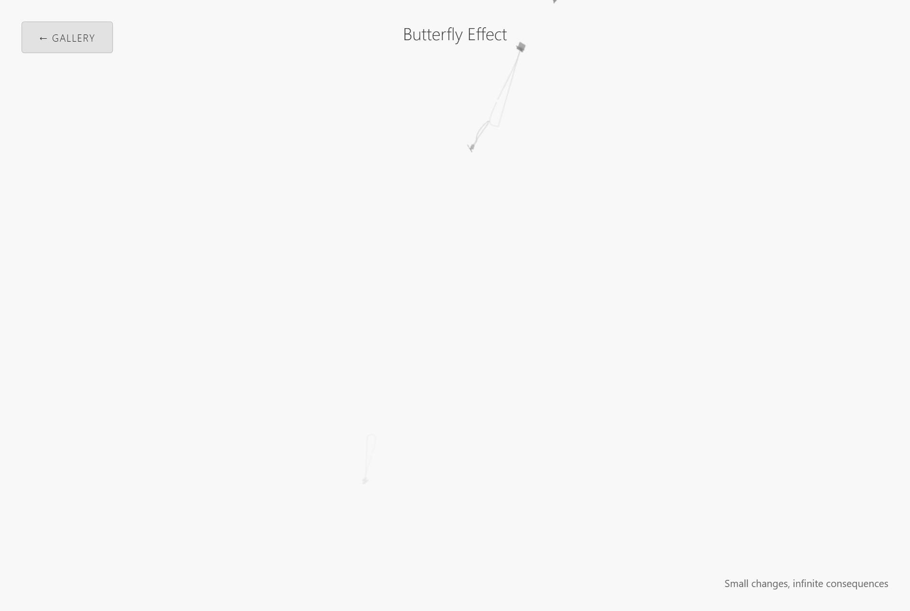
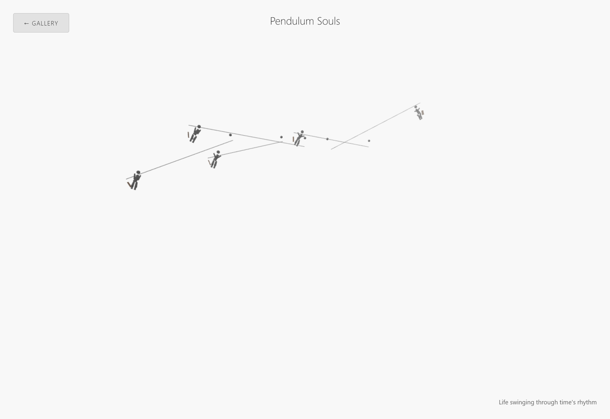
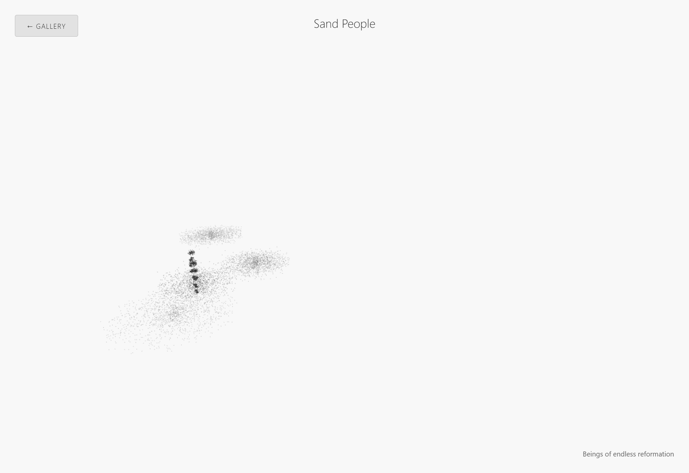
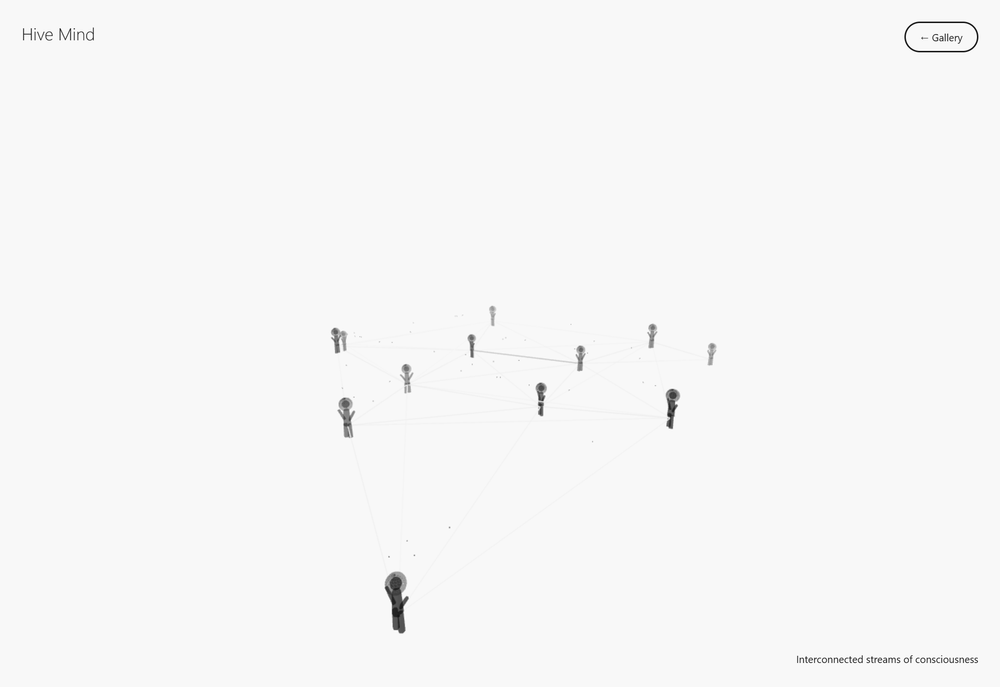

# Animated WebGL Library

> Pure WebGL/Canvas visualizations that make digital interfaces feel alive — not loud, just present.

**50+ self-contained HTML files. Zero dependencies at runtime. Drop one into any project and it works.**

---

## Examples

Every animation runs in a single HTML file. These are static captures — the real thing moves.

### Butterfly Effect
*Small changes, infinite consequences*

[](https://aptsalt.github.io/animated-webgl-library/50-journeys/butterfly-effect.html)

Butterfly-like shapes drift across the canvas with subtle trail effects. Each wing beat influences nearby particles. Use as a background for creative tools, portfolio sites, or anywhere you want quiet organic motion.

### Pendulum Souls
*Life swinging through time's rhythm*

[](https://aptsalt.github.io/animated-webgl-library/50-journeys/pendulum-souls.html)

Stick figures suspended on swinging pendulum lines — each figure moves at a slightly different phase, creating a hypnotic wave of human motion. Works well as a sidebar or header accent animation for productivity apps or music interfaces.

### Sand People
*Beings of endless reformation*

[](https://aptsalt.github.io/animated-webgl-library/50-journeys/sand-people.html)

A human figure composed entirely of sand particles — constantly dispersing and reforming. The figure never fully dissolves and never fully solidifies. This is the "conscience stripped to basic" idea at its most literal: a person as a cloud of matter that holds shape through will alone. Strong as a video filler or behind a text-heavy page.

### Hive Mind
*Interconnected streams of consciousness*

[](https://aptsalt.github.io/animated-webgl-library/50-journeys/hive-mind.html)

Multiple stick figures connected by a living network of lines — nodes pulse, connections strengthen and fade as figures move through space. Represents collective thought. Use behind collaboration tools, team dashboards, or any interface where "connected people" is the core metaphor.

> **Click any image above to see the live demo.** All 50+ visualizations are browsable at [aptsalt.github.io/animated-webgl-library/50-journeys/](https://aptsalt.github.io/animated-webgl-library/50-journeys/)

---

## Philosophy

Plain interfaces are dead interfaces. A chat window with a white background and blinking cursor feels like talking to a vending machine. A dashboard with nothing but data grids feels like staring at a spreadsheet. These are functional — but they are not *human*.

This library exists because **ambient motion is what separates a living space from a screenshot**.

### The Problem with Most Animation Libraries

They demand attention. Hero animations, loading spinners, scroll-triggered reveals — they all say *"look at me."* That is the opposite of what ambient design should do. A good environment animation is like background music in a cafe: you notice when it is gone, not when it is there.

### What This Library Does Differently

Every visualization here is designed to sit in the **periphery of attention**:

- **Background animations** that breathe behind your content — particle fields, ink flows, drift patterns
- **Corner/edge animations** that give life to dead zones of a layout — breathing circles, growth lines, ripple effects
- **Human figure silhouettes** built from particles, lines, and geometric primitives — not realistic, but recognizably human. The "image of conscience stripped to basic"
- **Environmental storytelling** through motion — a lone wanderer crossing the viewport, smoke rising, constellations forming

None of these fight your UI for attention. They coexist with it.

---

## Use Cases

### 1. Make AI Chat Interfaces Feel Human

The biggest UX failure of every AI chat product: it looks and feels like a terminal. A user is supposed to have a *conversation*, but the interface communicates nothing. No warmth, no presence, no environment.

Drop a `breathing-universe.html` or `drift-patterns.html` behind your chat. The conversation now happens *inside* a space, not on a blank page. The AI feels less like a function call and more like something present in the room.

```
Your app
+-- chat-container (z-index: 1)
|   +-- messages, input, etc.
+-- webgl-background (z-index: 0, position: fixed)
    +-- breathing-universe.html (iframe or extracted canvas)
```

### 2. Background Ambience for Any Web App

Dashboards, landing pages, portfolios, documentation sites — anywhere a static background makes the page feel lifeless:

| Animation | Best For |
|-----------|----------|
| `drift-patterns.html` | Minimal, professional backgrounds |
| `ink-flow.html` | Creative/artistic sites |
| `particle-beings.html` | Tech-forward dashboards |
| `breathing-circle.html` | Wellness/meditation apps |
| `constellation-beings.html` | Data/science platforms |
| `river-flow.html` | Content-heavy reading pages |
| `growth-forest.html` | Education platforms |
| `smoke-figures.html` | Storytelling/narrative sites |

### 3. Corner and Edge Animations

Not every page needs a full-screen background. Sometimes you want motion in just one corner — a subtle breathing element beside a logo, a particle system anchoring a sidebar, a growth animation framing a card.

Every visualization in this library can be:
- Constrained to a `<div>` of any size
- Clipped with `overflow: hidden` and `border-radius`
- Scaled down to thumbnail size and still readable
- Positioned absolutely in any corner of your layout

```html
<div style="position: absolute; bottom: 0; right: 0; width: 300px; height: 300px; overflow: hidden; opacity: 0.4;">
  <iframe src="breathing-circle.html" style="width: 100%; height: 100%; border: none;"></iframe>
</div>
```

### 4. Low-Compute Storytelling for Video and Film

Each visualization is a **self-contained narrative moment**. A figure walking. Smoke rising. A constellation forming from scattered dots. A phoenix rising from particles.

These are not meant to replace 3D renders or motion graphics. They are meant to be **fillers** — the 2-3 second transitions between scenes, the background behind a title card, the ambient loop during a podcast recording.

Why this works for video production:
- **Runs in a browser** — screen-record it, no render farm needed
- **Deterministic enough to loop** — most animations cycle naturally
- **Multiple stories from one codebase** — `lone-wanderer.html`, `bridge-walkers.html`, `phoenix-rise.html`, `metamorphosis.html` are each a complete visual narrative
- **Stripped-down human figures** — not photorealistic, not cartoon. Abstract silhouettes that represent the *idea* of a person. Conscience reduced to geometry. Works as visual metaphor in documentary, essay films, music videos, and motion poetry
- **The Life Journey series** (`human-figure/life-journey/`) tells a complete human story from `01-newborn-emergence` through `16-elderly-wisdom` — each a standalone scene

### 5. Ambient Environments for Productivity Tools

Note-taking apps, code editors, project management tools — any workspace that benefits from "a room that feels occupied" rather than a blank void.

The animations at 20-40% opacity behind content create the digital equivalent of working in a cafe with ambient life around you versus working in a sterile white room.

---

## What is Inside

```
animated-webgl-library/
|
+-- 50-journeys/                    # 50+ standalone WebGL visualizations
|   +-- breathing-circle.html       # Concentric circles that breathe
|   +-- lone-wanderer.html          # Solitary figure crossing landscape
|   +-- phoenix-rise.html           # Particle figure rising from dissolution
|   +-- ink-flow.html               # Organic ink spreading on canvas
|   +-- smoke-figures.html          # Smoke forming human silhouettes
|   +-- fractal-beings.html         # Fractal geometry forming figures
|   +-- constellation-beings.html   # Stars connecting into human forms
|   +-- metamorphosis.html          # Shape transformation sequences
|   +-- river-flow.html             # Flowing water with particle currents
|   +-- shadow-work-cave.html       # Confronting inner shadows
|   +-- emotion-ocean.html          # Tidal emotional landscapes
|   +-- memory-constellation.html   # Memories as star maps
|   +-- spiral-dance.html           # Spiral motion patterns
|   +-- string-theory.html          # Connected vibrating strings
|   +-- ... (50+ total)
|   +-- lib/
|       +-- theme-system.js         # Shared theme/color system
|
+-- core-files/                     # Framework and documentation
|   +-- lib/                        # Core engines
|   |   +-- psychology-engine.js    # Emotional state awareness
|   |   +-- therapeutic-protocols.js# Adaptive behavior protocols
|   |   +-- assessment-metrics.js   # Engagement measurement
|   |   +-- analytics-dashboard.js  # Usage analytics
|   |   +-- audio-engine.js         # Sound integration
|   |   +-- biometric.js            # Biometric input support
|   |   +-- shaders.js              # Custom WebGL shaders
|   |   +-- theme-system.js         # Color/mood theme system
|   |
|   +-- human-figure/               # Human silhouette library
|   |   +-- particle-being-library.js  # Particle-based human figures
|   |   +-- aesthetic/              # Artistic figure compositions
|   |   |   +-- solitary-walker.html
|   |   |   +-- shadow-figures.html
|   |   |   +-- crowd-formation.html
|   |   |   +-- ...
|   |   +-- motion/                 # 30 human figure motion studies
|   |   |   +-- human-figure-1-rising.html
|   |   |   +-- human-figure-11-dancing.html
|   |   |   +-- human-figure-24-particle-explosion.html
|   |   |   +-- human-figure-30-liquid-metal.html
|   |   |   +-- ...
|   |   +-- life-journey/           # Birth-to-wisdom narrative series
|   |       +-- 01-newborn-emergence.html
|   |       +-- 02-toddler-exploration.html
|   |       +-- 03-child-playing.html
|   |       +-- 16-elderly-wisdom.html
|   |       +-- ...
|   |
|   +-- DESIGN_SYSTEM.md
|   +-- INTEGRATION_GUIDE.md
|   +-- PSYCHOLOGICAL_FRAMEWORK.md
|   +-- THEME_SYSTEM_INTEGRATION_GUIDE.md
|
+-- human-figure/life-journey/      # Additional life journey scenes
    +-- 21-river-journey.html
    +-- 22-mountain-climber.html
    +-- 23-ocean-swimmer.html
    +-- ...
```

---

## Quick Start

### As a Background (iframe)

```html
<style>
  .ambient-bg {
    position: fixed;
    top: 0; left: 0;
    width: 100%; height: 100%;
    z-index: 0;
    opacity: 0.3;
    pointer-events: none;
  }
  .content {
    position: relative;
    z-index: 1;
  }
</style>

<iframe class="ambient-bg" src="50-journeys/drift-patterns.html" frameborder="0"></iframe>
<div class="content">
  <!-- your actual UI here -->
</div>
```

### As a Corner Element

```html
<div style="position: fixed; bottom: 0; right: 0; width: 250px; height: 250px; overflow: hidden; border-radius: 50%; opacity: 0.25; pointer-events: none;">
  <iframe src="50-journeys/breathing-circle.html" style="width: 400px; height: 400px; border: none; margin-left: -75px; margin-top: -75px;"></iframe>
</div>
```

### Extract the Canvas Directly

Every file is a self-contained HTML document using Three.js from CDN. You can:
1. Copy the `<script>` block into your own page
2. Point the renderer at your own `<canvas>` element
3. Adjust colors, speeds, particle counts to match your design system

```javascript
// Most visualizations follow this pattern:
const renderer = new THREE.WebGLRenderer({
  canvas: document.getElementById("your-canvas"),
  antialias: true,
  alpha: true  // transparent background — layer over your UI
});
```

### For Video Production

1. Open any `.html` file in a browser
2. Resize the window to your target resolution (1920x1080, 4K, vertical, etc.)
3. Screen-record with OBS, ScreenFlow, or browser DevTools recorder
4. Use as background plate, transition, or ambient loop in your editor

---

## Design Principles

1. **Periphery, not center** — Animations occupy the edges of attention. They should be noticeable when someone looks for them, invisible when someone is focused on content.

2. **Organic, not mechanical** — Every motion uses easing curves modeled on natural movement. No linear interpolation, no sudden starts/stops. Things breathe, drift, and flow.

3. **Abstract human, not realistic** — Human figures are particles, lines, and geometry. This is deliberate. A photorealistic figure demands narrative context. An abstract silhouette *is* the narrative — it represents the idea of a person, a conscience, an observer.

4. **Self-contained, not coupled** — Each file works on its own. No build step, no package manager, no framework dependency. Open the HTML file. It works.

5. **Low compute, high presence** — Most visualizations use 40-100 particles or a handful of geometric primitives. They run at 60fps on integrated graphics. They are designed to be background processes, not GPU benchmarks.

---

## Customization

Every visualization exposes the same levers:

| Parameter | Where to Find It | What It Controls |
|-----------|-------------------|------------------|
| Particle count | `createXxx()` function | Density and complexity |
| Colors | Material definitions | Mood and brand alignment |
| Opacity | Material `opacity` property | How subtle or prominent |
| Speed | `time += 0.01` increment | Animation pace |
| Scale | Camera `position.z` | How zoomed in or out |
| Background | `scene.background` | Base canvas color |

Set `alpha: true` on the renderer and remove `scene.background` to make any visualization transparent — ready to layer over your existing UI.

---

## The Human Figure System

The `particle-being-library.js` provides a reusable system for creating human silhouettes from particles:

- **Rising** — figure emerging from scattered particles into form
- **Dissolving** — figure breaking apart into dust
- **Walking** — locomotion cycle from connected nodes
- **Dancing** — rhythmic motion patterns
- **Morphing** — figure transforming between poses
- **Constellation** — figure formed by connecting stars
- **Liquid Metal** — fluid metallic figure transformations
- **Pixel Art** — low-resolution figure studies
- **Double Exposure** — overlapping transparent figures

These are the "image of conscience stripped to basic" — a person reduced to their essential geometry. Useful anywhere you need to represent *a human* without the baggage of realism: meditation apps, philosophical content, documentary visuals, abstract storytelling.

---

## The Life Journey Series

A complete human narrative told through particle animations:

| Scene | Stage |
|-------|-------|
| `01-newborn-emergence` | First breath, particles coalescing into form |
| `02-toddler-exploration` | Uncertain steps, discovering boundaries |
| `03-child-playing` | Free movement, joy as physics |
| `11-athlete-competing` | Peak performance, controlled energy |
| `16-elderly-wisdom` | Settled particles, stillness as strength |
| `21-river-journey` | Life as flowing water |
| `22-mountain-climber` | Overcoming resistance |
| `24-sky-diver` | Letting go |

Each scene works standalone or sequenced together for a long-form visual narrative.

---

## Technical Details

- **Runtime dependencies**: None (Three.js loaded from CDN, can be vendored)
- **Browser support**: Any browser with WebGL (97%+ coverage)
- **Performance**: Targets 60fps on integrated graphics at default settings
- **File size**: Each visualization is a single HTML file, typically 5-15KB
- **Responsive**: All visualizations auto-resize to container dimensions
- **Language split**: 85% HTML, 15% JavaScript — everything is inline and inspectable

---

## Advanced: Psychology Engine

The `core-files/lib/` directory contains an optional framework for adaptive visualizations that respond to user emotional state. This includes:

- **psychology-engine.js** — Maps user interactions to emotional state models
- **therapeutic-protocols.js** — Adjusts animation parameters based on detected state (calming down fast motion for anxious users, warming colors for low-energy states)
- **biometric.js** — Optional integration with biometric inputs (heart rate, breathing)
- **theme-system.js** — Dynamic color system that shifts based on time of day, user preference, or emotional context

This is optional infrastructure. The standalone HTML files work without any of it.

---

## License

Open source. Use these in your projects — commercial, personal, whatever.

---

*Built for people who believe digital spaces should feel like spaces, not spreadsheets.*
